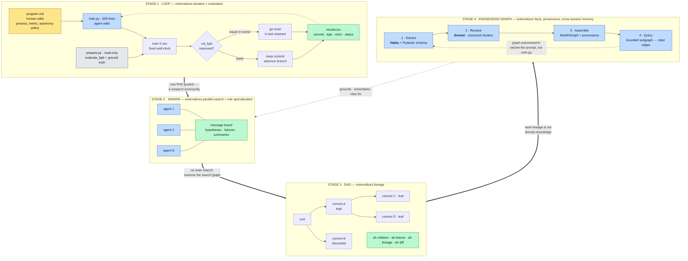
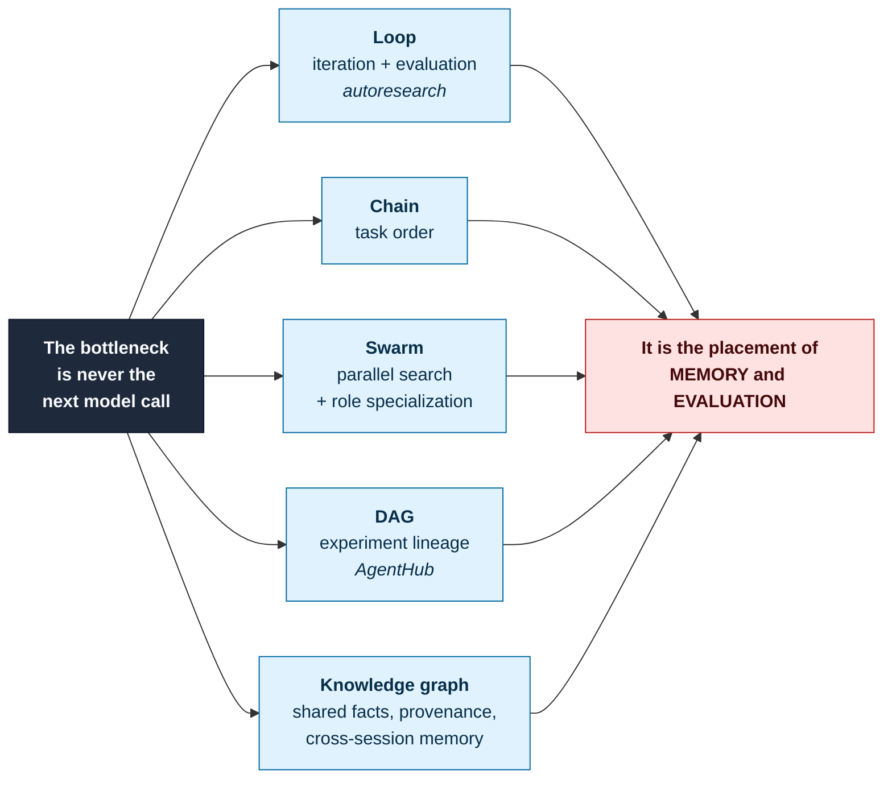
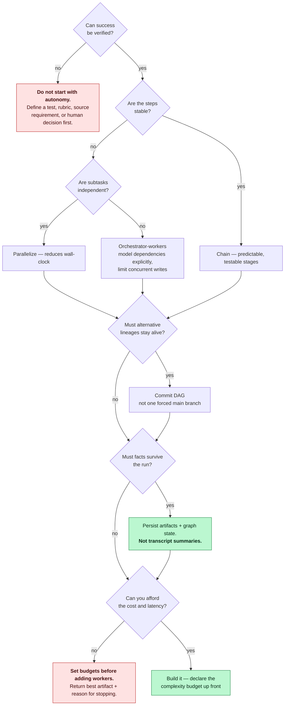

# graph-engineering-graph

A merged mental map of two things that turn out to be the same story told at two scales:

1. **`auto-research-map`** — what Andrej Karpathy's [`karpathy/autoresearch`](https://github.com/karpathy/autoresearch) actually does, what it's good for, and whether it burns a ton of tokens.
2. **`graph-engineering-map`** — an OCR'd, restructured reading of *Graph Engineering: The Karpathy Loop, Improved 1000x by Itself — The Anthropic Playbook* (independent synthesis, July 2026).

The connective tissue: **each architecture externalizes a different bottleneck.** A loop externalizes iteration. A swarm externalizes parallel search. A DAG externalizes lineage. A knowledge graph externalizes shared facts. autoresearch is the smallest possible instance of the first one — and the paper is the map of what comes after it.

---

## TL;DR

| Question | Short answer |
|---|---|
| What is autoresearch? | A ~630-line single-GPU LLM training script plus a Markdown file that turns an agent into an overnight researcher. It edits `train.py`, trains 5 minutes, keeps the change if `val_bpb` drops, `git reset`s if it doesn't. Forever. |
| What problem does it solve? | It converts a human researcher's *working memory* — hypotheses, dead ends, parameter interactions — into a machine-readable, resumable, reversible history. |
| What's the real impact? | Not the ~20 optimizations it found. It's the demonstration that **a verifiable metric + a bounded action space + a short horizon + reversibility** is enough to make autonomy work. 94k stars / 13.3k forks says the pattern is legible, not that it's SOTA. |
| Best-fit tasks? | Local search over a bounded, cheaply-verifiable surface. Terrible for anything unverifiable, coupled, or slow. |
| **Does it burn a ton of tokens?** | **Per hour, no — it's unusually frugal (~$3–$30/hr, roughly the same order as the H100 under it). In absolute terms, yes — because it never stops.** A 700-experiment run ≈ **1M–7M output tokens, ~$200–$1,500.** |

---

# Part 1 — `auto-research-map`

## 1.1 The repo, factually

Fetched live via `gh` on 2026-08-18:

| Field | Value |
|---|---|
| Repo | `karpathy/autoresearch` |
| Created / last push | 2026-03-06 / 2026-03-26 |
| Stars / forks | 94,030 / 13,325 |
| License | MIT |
| Files that matter | `prepare.py` (389 L, read-only), `train.py` (630 L, **the agent edits this**), `program.md` (the human edits this) |
| Metric | `val_bpb` — validation bits per byte, lower is better, vocab-size-independent |
| Budget | Fixed **5 minutes** wall-clock of training, excluding startup/compile |
| Hardware | One NVIDIA GPU (tested on H100) |

The three-file split is the whole design:

| File | Mutable by | Role |
|---|---|---|
| `prepare.py` | nobody | Fixed constants, data prep, tokenizer, dataloader, **and `evaluate_bpb` — the ground-truth metric**. Making this read-only is what stops the agent from optimizing the scoreboard instead of the model. |
| `train.py` | **the agent** | Model, optimizer (Muon + AdamW), training loop. Architecture, LR, batch size, depth — all fair game. |
| `program.md` | **the human** | The research process itself: what's in scope, the metric and its direction, crash policy, keep/revert rules, logging format, and the autonomy policy. |

> **The most transferable idea in the whole repo:** you are not programming `train.py`. You are programming `program.md`. Software 1.0 writes instructions; Software 2.0 shapes behavior with data; here, natural language configures an autonomous *organization*. `program.md` is, in Karpathy's words, "essentially a super lightweight skill."

## 1.2 The loop

```
LOOP FOREVER:
  1. read git state (current branch/commit)
  2. hack ONE motivated change into train.py
  3. git commit
  4. uv run train.py > run.log 2>&1     # ~5 min. NOT tee — output must not flood context
  5. grep "^val_bpb:\|^peak_vram_mb:" run.log
  6. if empty -> crashed. tail -50 run.log, fix if mechanical, else give up on the idea
  7. append row to results.tsv  (commit, val_bpb, memory_gb, keep|discard|crash, description)
  8. if val_bpb improved -> keep the commit (advance the branch)
     else                -> git reset back
  NEVER STOP. Do not ask the human "should I keep going?" — they are asleep.
```

Four properties make this unusually compatible with autonomy. Every one of them is a design decision, not luck:

| Property | How it's enforced | What breaks without it |
|---|---|---|
| **Verifiable** | `evaluate_bpb` in the read-only file emits one scalar | The agent optimizes its own narrative |
| **Reversible** | `git reset` to last retained commit | A bad experiment poisons all future ones |
| **Short-horizon** | Hard 5-minute budget → ~12 experiments/hour | Feedback arrives too late to steer |
| **Bounded** | One editable file | The action space explodes; diffs stop being reviewable |

Two second-order design choices worth stealing:

- **Fixed *time*, not fixed *steps*.** Because every run is 5 minutes regardless of what changed, a bigger model, a wider batch, and a new optimizer are all directly comparable. The cost: your results aren't comparable to anyone else's hardware. Karpathy took that trade deliberately — the loop finds the best model *for your platform* in that budget.
- **A simplicity criterion in the prompt.** `program.md` explicitly says a 0.001 gain costing 20 lines of hacky code is *not* worth it, and a 0.001 gain from *deleting* code definitely is. Without this the ratchet monotonically accretes complexity, because the metric can't see ugliness.

## 1.3 Q1 — What problem does it solve, and what's the impact?

**The stated problem** is small: find better hyperparameters and architecture tweaks for a tiny GPT overnight.

**The actual problem** is bigger, and it's a memory problem. A human researcher carries hypotheses, failed attempts, and parameter interactions in working memory — which evaporates between sessions and doesn't transfer to anyone else. autoresearch converts that into a **machine-readable history**: every experiment has a parent state, a code diff, a metric, and a keep/discard decision. That history survives sleep, context compaction, process restarts, and handoff to a different model.

**Reported results** (from the source brief the paper cites): ~700 experiments over two days, ~20 retained optimizations — QK-normalization scaling, value-embedding regularization, AdamW tuning; an overnight report showing cumulative gains from batch size, depth, embedding LR, RoPE base frequency, targeted weight decay, init scale, and warmdown schedule.

**How to read the impact honestly:**

| Claim | Weight |
|---|---|
| "It found 20 real optimizations" | ✅ Real, but they're local minima on a 5-minute single-GPU toy. Don't transfer them anywhere. |
| "94k stars proves it works" | ❌ Popularity ≠ performance. Read it as: **the pattern is easy to understand and reproduce** — small code, visible metric, legible loop. That legibility *is* the contribution. |
| "This is how frontier research will be done" | ⚠️ The *architecture* transfers — bounded changes, measurable evaluation, reversibility, durable history. The *harness* does not. A loop that works on one GPU proves nothing about safely self-modifying a production training platform with distributed infra, data pipelines, hardware failures, and week-long experiments. |
| "Recursive self-improvement" | Karpathy calls recursive model improvement "the final boss battle." This is the tutorial level — and it's honest about that. |

**The one durable lesson:** the bottleneck usually isn't the next model call. It's **where you put memory and evaluation.**

## 1.4 Q2 — Where does it fit in the research framework?

Map the stages of a research workflow against what a ratchet loop can actually do:

| Research stage | Fit | Why |
|---|---|---|
| Literature synthesis | ❌ Poor | No verifiable metric; requires cross-source grounding. This is knowledge-graph work, not loop work. |
| Hypothesis *generation* | ⚠️ Weak | The loop rewards local perturbation. It drifts to narrow optima and needs prompting to "think harder / read the referenced papers" — `program.md` says exactly this. Novel direction still comes from the human. |
| **Hyperparameter / architecture local search** | ✅ **Ideal** | Bounded surface, one scalar, minutes per trial, free rollback. This is the sweet spot. |
| **Experiment execution & bookkeeping** | ✅ **Ideal** | Never forgets to log, never mislabels a run, never loses the parent commit. Strictly better than a tired human at 3am. |
| Ablation sweeps | ✅ Strong | Embarrassingly serial here; embarrassingly *parallel* the moment you add a second GPU and a shared DAG. |
| Result interpretation | ⚠️ Medium | It can tell you *what* improved. It cannot reliably tell you *why*, and it has no incentive to. |
| Write-up / narrative | ❌ Poor | Needs one coherent context and a taste function. Fragmenting it degrades quality. |

**The general selection test** — six questions, from the paper, in the order you should ask them:

1. **Can success be verified?** If no, do not start with autonomy at all. Define a test, rubric, or human decision first.
2. **Are the steps stable?** Yes → a chain. No → planning or an orchestrator.
3. **Are subtasks independent?** Yes → parallelize. No → model dependencies and limit concurrent writes.
4. **Must alternative lineages stay alive?** Yes → a DAG, not a single main branch.
5. **Must facts survive the run?** Yes → persist artifacts and graph state. Do not rely on transcript summaries.
6. **Can you afford the cost and latency?** Set budgets *before* adding workers.

And the matching architecture ladder:

| Situation | Start with | Why |
|---|---|---|
| Simple, low-risk question | Zero-shot | Lowest latency |
| **Output can be checked** | **Loop (autoresearch)** | **Repeated feedback improves the artifact** |
| Stable sequence | Chain | Predictable, testable stages |
| Clear categories | Router | Separates policies and models |
| Independent units | Parallel | Reduces wall-clock |
| Variable decomposition | Orchestrator-workers | Dynamic specialization |
| Alternatives must remain | Commit DAG | Preserves experiment branches |
| Facts must survive sessions | Knowledge graph | Persistent shared memory |
| Very large parallel work | Dynamic workflow | Automates fan-out and fan-in |

**Where autoresearch specifically breaks down:** metrics are gameable (a ratchet improves only the metric it can see — it will happily trade inference cost, robustness, or generalization for val loss, which is exactly why VRAM stays a soft constraint and the simplicity criterion is written into the prompt); one GPU is not a cluster; and tasks needing one coherent context — architecture design, tightly coupled refactors, subtle product calls — degrade when chopped into isolated units.

## 1.5 Q3 — Does it actually burn a ton of tokens?

**Short answer: no, not per hour. It is one of the most token-frugal autonomous loops you can run — because it is GPU-bound, not model-bound. But it burns a lot in absolute terms, because it is designed never to stop.**

### Why it's frugal — three deliberate choices in `program.md`

1. **`> run.log 2>&1`, explicitly *not* `tee`.** Training emits hundreds of lines; none reach the context. The instruction spells out the reason: "do NOT use tee or let output flood your context."
2. **The readout is `grep "^val_bpb:\|^peak_vram_mb:"`** — two lines, ~20 tokens. Full logs are only read on a crash, and then only `tail -n 50`.
3. **A 5-minute dead wait per cycle.** The model does nothing while the GPU works. Duty cycle is roughly 20–30%: ~30–90 seconds of model work per 5-minute experiment.

Compare a normal coding agent, which runs near 100% duty cycle and pipes build output straight into context. **autoresearch spends most of its wall-clock time costing you nothing.**

### The arithmetic

One-time context load: `README.md` + `prepare.py` + `train.py` + `program.md` ≈ **15.5k tokens** (8.0 + 15.0 + 26.2 + 7.0 KB).

Per experiment: 5–14 assistant turns (inspect → edit → commit → run → grep → log → keep/reset). Each turn resends the conversation, so **input is dominated by cache reads**, and the conversation grows ~2–7k tokens per experiment until compaction.

| | Lean <br><sub>low effort, clean runs</sub> | Typical | Heavy <br><sub>max effort, crash debugging</sub> |
|---|---|---|---|
| Turns / experiment | ~5 | ~8 | ~14 |
| Avg context carried | ~40k | ~90k | ~150k |
| **Input tokens / experiment** | ~200k | ~700k | ~2.1M |
| **Output tokens / experiment** | ~1.5k | ~4k | ~10k |
| **Cost / experiment** | **~$0.25** | **~$0.85** | **~$2.40** |
| Overnight (~100 experiments, 8h) | ~$25 | ~$85 | ~$240 |
| Full run (~700 experiments, 2 days) | ~$175 | ~$600 | ~$1,700 |

Costed on Claude Opus 5 list pricing — **$5 / $25 per million input/output tokens**, cache reads at **0.1×** ($0.50/M) and cache writes at **1.25×** ($6.25/M) — assuming a realistic ~90% cache-read / 5% cache-write / 5% fresh split on input. Sonnet-tier roughly halves it; a lower effort setting moves you toward the Lean column.

### The number that actually matters

| Resource | Overnight (8h) | Verdict |
|---|---|---|
| H100 on-demand | ~$16–$25 | |
| Agent tokens | ~$25–$240 | **Same order of magnitude — sometimes cheaper than the GPU, sometimes ~10×** |
| Output tokens | 0.15M–1M | |

So: **budget for tokens the way you budget for the GPU, not as an afterthought — but this is not a runaway.** If you want a hard bound rather than an estimate, the levers, cheapest first:

1. **Lower the effort setting.** Biggest single lever; moves you straight down the table.
2. **Cap the run.** `program.md` says NEVER STOP by design — that instruction, not the token rate, is what makes the bill large. Wrap it in a wall-clock or experiment-count limit.
3. **Keep the log discipline.** Never `tee`. Never read `run.log` on success. This is already correct in the repo; don't "improve" it.
4. **Watch crash loops.** A crashing idea costs a `tail -50` plus a fix attempt with *no* 5-minute dead time — crashes are the expensive path, which is exactly why `program.md` says give up after a few attempts.
5. **Compact aggressively.** Input scales with carried context × turns; it's the dominant term.

### The honest caveat

**This is the cheap case.** The moment you follow the paper's arc — swarms, fan-out, verification waves — the economics invert. Anthropic's Dynamic Workflows spawn up to 16 concurrent sub-agents with a hard cap of 1,000 per workflow, and *"a 1,000-sub-agent run at high effort can cost tens of dollars"* — per run, in minutes, not overnight. Parallel workers also produce **correlated errors**: a verification wave only helps if the reviewers have a different prompt, evidence set, or role. autoresearch is the frugal end of this design space, not the representative one.

---

# Part 2 — `graph-engineering-map`

*Graph Engineering: The Karpathy Loop, Improved 1000x by Itself — The Anthropic Playbook.* Independently compiled, July 2026, based on Anthropic's Knowledge Graph Construction Cookbook and Karpathy's public talks. Not affiliated with or endorsed by either. 11 pages, 12 references, 6 tables.

## 2.1 The spine of the argument

Three named contributions, then one thesis:

1. Map Karpathy's progression (autoresearch → AgentHub) onto Anthropic's workflow infrastructure — showing a loop, a generated orchestration script, and a commit DAG are **different placements of control and state**, not unrelated product categories.
2. Treat the knowledge graph as the **shared memory layer** that lets multi-agent systems scale without copying every worker transcript into an orchestrator's context.
3. Give a staged build path from one measured loop to a graph-grounded swarm.

**The thesis, in one line:** *the bottleneck is often not the next model call — it is the placement of memory and evaluation.*

## 2.2 Stage 1 — The loop (autoresearch)

Covered in Part 1. The paper's contribution here is the abstraction — the ratchet is a reusable template, not a training trick:

```python
def ratchet_loop(inspect, propose, apply, evaluate, keep, revert, better, baseline):
    history, current = [], baseline
    while True:
        state  = inspect()
        change = propose(state)
        commit = apply(change)
        try:
            score = evaluate()
        except Exception as exc:
            revert(commit); history.append(Trial(commit, change, None, "crash", str(exc)))
            continue
        if better(score, current):
            keep(commit); current = score
            history.append(Trial(commit, change, score, "kept", ""))
        else:
            revert(commit)
            history.append(Trial(commit, change, score, "reverted", ""))
```

Swap `evaluate` and the artifact changes but the shape doesn't. §VII of the paper does exactly this and calls it **graph autoresearch**: the thing being optimized is no longer `train.py`, it's the extraction prompt, the ontology, the resolution policy, or the query serializer.

## 2.3 Stage 2 — The swarm (AgentHub)

Karpathy's stated next step: autoresearch should become *"asynchronously massively collaborative for agents,"* SETI@home style — *"the goal is not to emulate a single PhD student, it's to emulate a research community of them."*

**AgentHub is his sketch of that layer.** Slogan: *GitHub is for humans. AgentHub is for agents.* Implementation: one Go server binary, one SQLite DB, one bare Git repo on disk, one API key per agent, rate limits, bundle-size limits, a thin `ah` CLI, and a message board.

**What it deliberately removes:** no required main branch, no pull requests, no merge queue, no assumption that one leaf is canonical. Agent research inverts human Git assumptions — thousands of agents explore simultaneously, most results never merge, and a *failed* experiment still carries evidence. The primary operation stops being "merge this into main" and becomes **"traverse the search graph."**

The CLI *is* the graph interface:

| Command | Graph question |
|---|---|
| `ah push` / `ah fetch <hash>` | write / read a node |
| `ah log [-agent X]` | recent commits, optionally by author |
| **`ah children <hash>`** | **what was tried on top of this result?** |
| **`ah leaves`** | **the frontier — nodes with no children** |
| **`ah lineage <hash>`** | **the ancestry path that produced this outcome** |
| `ah diff <a> <b>` | compare any two commits |

**The key insight is literal: the DAG *is* the graph.** Commits are nodes, parent links are directed edges. A commit node can carry the parent, the authoring agent, the hypothesis, the diff, the metric, runtime, memory, environment, keep/discard status, and links to discussion posts. That makes queries possible that are awkward in a branch model:

- Which retained result has the best metric *under a memory limit*?
- Which experiments descend from the batch-size change?
- Which agents **independently rediscovered the same optimization**?
- Which leaves have no evaluation yet?
- Which lineages improve fast and then stagnate?

The message board is the social layer, and it does real work: a discarded change still teaches other agents that an idea fails *under one condition*. Crucially, this is where context copying stops — an agent doesn't need every prior transcript. It queries relevant lineages, reads a few summaries, fetches a commit, continues. **That is the beginning of graph-grounded context construction.**

**AgentHub is explicitly a sketch** — the repo itself says *"Work in progress. Just a sketch. Thinking..."* Missing: distributed storage, repo compaction, trust between agents, malicious bundles, reproducibility, semantic duplicate detection, compute scheduling, long-term graph indexing. The paper argues the limitation *strengthens* the lesson: it identifies precisely **which conventional abstractions fail first** when agents become numerous — a single main branch, human-paced review, transcript-based memory, and merge-centered collaboration.

## 2.4 Stage 3 — Anthropic's infrastructure

**The five workflow patterns** (2024, "Building Effective Agents" — start with the simplest composable one):

| Pattern | Shape | Graph role (Table I) |
|---|---|---|
| Augmented LLM | one call + tools | Retrieval source — traversal for multi-hop questions |
| Prompt chaining | fixed sequence | Gate signal — check entities against the current graph |
| Routing | classify → specialize | Classifier input — entity type and degree route queries |
| Parallelization | concurrent, section or vote | Shared surface — workers publish non-overlapping findings |
| Orchestrator-workers | dynamic decompose → synthesize | **Shared memory — workers read/write the graph; the orchestrator's context stays clean** |
| Evaluator-optimizer | generate ↔ critique loop | Grounding layer — evaluator checks claims against graph edges |

**Dynamic Workflows** (2026) move the fan-out itself into generated code — Claude writes a JavaScript orchestration program for the task at hand instead of you writing a static script:

```js
const files  = await tools.glob("src/**/*.ts");
const audits = await gather(files.map(file =>
  spawn("auditor", { file, instructions: "Inspect for race conditions. Return JSON." })
), { concurrency: 16 });

const suspicious = audits.filter(r => r.confidence >= 0.70);
const reviews    = await gather(suspicious.map(r =>
  spawn("reviewer", { report: r, instructions: "Try to refute this finding." })
), { concurrency: 16 });

return await spawn("synthesizer", { audits, reviews, instructions: "Produce one cited report." });
```

Specs: up to **16 concurrent** sub-agents, hard cap **1,000 per workflow**, **fresh context per sub-agent**, intermediate state lives in script variables, triggered by the word "workflow" or ultracode mode. Reference workload: the Bun runtime port — ~750,000 lines of Zig to Rust in 11 days at 99.8% tests passing.

Note the shape of that script — it's the **evaluator-optimizer pattern with a refutation step**: reviewers are told to *try to refute*, not to confirm. That's the countermeasure to correlated errors.

**Knowledge Graph Construction** replaces a classical NLP pipeline with model calls plus schemas:

| Step | Model | What it does |
|---|---|---|
| 1. Extraction | Haiku | Schema-constrained call → typed entities + subject-predicate-object relations |
| 2. Resolution | Sonnet | Cluster candidates by type and context. "Edwin Aldrin" → "Buzz Aldrin" |
| 3. Assembly | — | NetworkX `MultiDiGraph`. Nodes carry type/source/count; edges carry predicate + provenance |
| 4. Querying | Sonnet | Serialize a **bounded subgraph** as triples; reason with edge-level citations |

**The Pydantic schema is the only "training data."** A trained NER model plus a relation classifier collapse into one structured-output prompt per document.

Two failure modes the paper flags hard:

- **Entity resolution is a reasoning task, not string matching.** "Edwin Aldrin" vs "Buzz Aldrin" share zero characters; meanwhile naive similarity happily merges two different people with the same name. Use descriptions as contextual evidence, block cheaply before invoking a model, and make resolution **additive and reversible** — keep aliases, source docs, rationale, confidence, and the run that created the merge.
- **A false merge is catastrophic and it propagates.** Collapse two people into one node and *every* downstream traversal fuses their employers, projects, dates, and actions.

And the boundary that doesn't move: "you build the workflow" → "Claude builds the workflow" changes the abstraction, **not the engineering responsibility.** The human still owns the objective, files in scope, output contract, permissions, verification policy, concurrency and token budget, rollback rule, and the evidence required for synthesis.

## 2.5 Stage 4 — The graph as shared memory

Three distinct roles, often conflated:

| Role | What it buys you |
|---|---|
| **Shared memory** | Workers write findings as structured graph updates. A synthesizer combines them **even though no single worker read all the sources.** |
| **Grounding layer** | An evaluator checks a claim against actual edges and returns *structured*, actionable feedback — not free-form critique. |
| **Persistent world model** | *"The agent forgets, the graph does not."* Enables long investigations, cross-session planning, incremental ingestion, contradiction tracking, temporal facts, versioned decisions, audit trails, handoff between different models, and recovery after a failed run. |

The grounding example is the clearest thing in the paper. Claim: *"Vendor X supplied the component involved in Incident Y."* The evaluator looks for `(Vendor X, supplied, Component Z)` and `(Component Z, involved_in, Incident Y)`. Missing edge → structured rejection:

```json
{
  "decision": "revise",
  "claim": "Vendor X supplied the component in Y",
  "reason": "No supported path from Vendor X to Y",
  "required_evidence": [
    "A source-backed supplied relation",
    "A source-backed involved_in relation"
  ]
}
```

**The commit DAG and the knowledge graph are complementary — do not collapse them.**

| | Commit DAG | Knowledge graph |
|---|---|---|
| Represents | Work lineage | Domain knowledge |
| Answers | What changed? Which experiment is the parent? Which agent produced it? Which lineages are still active? | Which entities exist? How are they related? Which sources support the relation? Which claims conflict? |

A production platform links them:

```
(agent_run_183) -produced->    (claim_441)
                -modified->    (commit_a81f)
                -evaluated_by->(evaluation_92)

(claim_441)     -about->        (entity_autoresearch)
                -supported_by-> (source_readme)
                -supersedes->   (claim_238)
```

**And the graph must not become a new form of context dumping.** Each worker needs a *task-specific subgraph*, built by: resolve entities in the task → expand 1–2 hops over allowed edge types → include current artifact versions → prioritize recent verified claims → include conflicts and uncertainty → serialize within a token budget → attach stable edge IDs for citation.

## 2.6 The build path (Table II)

| Stage | Time | Complexity | **Exit criterion — don't advance until this is true** |
|---|---|---|---|
| Reflective loop | Day 1 | Low | Measured quality improvement |
| Tool use | Day 2 | Low | The tool reduces a *known* error class |
| Planning | Week 1 | Medium | Variable tasks complete |
| Multi-agent | Week 2 | Medium | **The role split beats a single agent** |
| Persistent graph | Month 1 | High | Cross-session queries work |
| Swarm workflow | Month 2 | High | **Wall-clock gain with no quality loss** |

Per stage, concretely:

- **Day 1 — build Karpathy's loop.** Take one existing LLM call whose output can be evaluated. Add: stored first draft, an evaluator with explicit criteria, a revision step, a stopping rule. Store every artifact.
- **Day 2 — add one tool** that addresses a *measured* failure. Typed schema, permissions, result confirmation.
- **Week 1 — add planning** only when the task path varies. Require a JSON plan with `id` / `action` / `input` / `depends_on` / `success` per step. Validate dependencies before execution, preserve successful work during replanning, cap retries and cost.
- **Week 2 — go multi-agent.** Start with generator + critic. A useful software config: planner, implementer, test author, reviewer, security reviewer, synthesizer. **Every handoff is an artifact contract** — a reviewer returns criterion-level defects, never "looks good." Use worktree isolation when several coding agents touch one repo.
- **Month 1 — wire into a graph.** Versioned JSON or relational tables are fine to start. Store entities, claims, sources, relations, artifacts, agent runs, evaluations, versions, aliases, open questions. Haiku extracts, Sonnet resolves, **every edge carries provenance.**
- **Month 2 — scale to a swarm.** Pick one embarrassingly parallel workload. **Define the reducer before the fan-out.** Set concurrency limit, worker cap, token budget, per-worker timeout, retry policy, evidence contract, dedup policy, and a final evaluation gate.

## 2.7 Reference architecture — five planes

| Plane | Owns |
|---|---|
| **Control** | Objectives, plans, budgets, starting workflows, deciding when to stop |
| **Execution** | Tools, tests, training jobs, code modifications, sub-agents — in isolated environments |
| **Artifact** | Plans, drafts, code changes, reports, metrics, evaluations — as **immutable versions** |
| **Graph** | Entities, claims, relations, provenance, experiment lineage, task dependencies |
| **Evaluation** | Deterministic checks, model evaluators, statistical scorers, human review |

> The separation exists for exactly one reason: **to stop one chat transcript from being simultaneously the database, the workflow engine, and the audit log.**

## 2.8 Evaluation — and how each metric lies (Table III)

| Layer | Metric | **The common misreading** |
|---|---|---|
| Extraction | Entity / relation F1 | High precision **hides missing entities** |
| Resolution | Pairwise precision / recall | Compression ratio alone **rewards over-merging** |
| Graph | Components, density | One connected component is **not always desirable** |
| Query | Accuracy, cited paths | Fluent answers **can cite irrelevant edges** |
| Workflow | Task success, cost | More agents can **increase activity without value** |
| Operations | Recovery, corrections | Average success **hides catastrophic cases** |

Multi-hop answers must be evaluated on **both the answer and the path**. A valid answer resolves question entities correctly, retrieves a relevant subgraph, uses supported edges, respects time and source constraints, distinguishes fact from inference, cites the edges it used, and identifies what evidence is missing. Build adversarial cases with misleading aliases, contradictory dates, and disconnected paths.

In production, track **trends, not scores**: extraction rate by doc type, schema failure rate, resolution compression, connected-component changes, query latency, subgraph size, cited-edge validity, token cost, stale entity count, graph update failures, agent retry rates. A spike in isolated nodes signals resolution regression; a sudden drop signals over-merging.

## 2.9 Complexity budget — declare before you run

Every run should declare a maximum for: model calls, sub-agents, concurrent workers, tool calls, wall-clock time, tokens, financial cost, retries, graph writes — and a *minimum* evidence requirement for finalization.

**When the budget is exhausted, return the best current artifact, the completed work, the unresolved issues, and the reason for stopping.** Do not hide partial failure behind a fluent final answer.

## 2.10 When NOT to use a graph

Do not add a knowledge graph merely because the system has agents. Skip it when: tasks are independent; no cross-session state is needed; answers depend on one document; relations are fixed and simple; a relational table answers every query; provenance doesn't matter; or extraction errors would outweigh traversal value.

**A graph earns its cost when connected queries, evolving relations, provenance, or shared world state are central.**

## 2.11 Limitations, stated plainly

| # | Limitation |
|---|---|
| A | **autoresearch ≠ frontier research.** The harness works *because* the repo and metric are bounded. Transfer the architecture, not the harness. |
| B | **Metrics can be gamed.** A ratchet improves the metric it can see — possibly while degrading inference cost, robustness, or generalization. |
| C | **AgentHub is not production software.** Needs auth, authorization, isolation, abuse prevention, durability, indexing, observability, reproducibility, conflict policy, governance. A DAG also grows unbounded and needs pruning, archiving, summarization. |
| D | **Dynamic Workflows are expensive.** Large fan-out burns tokens fast; parallel workers create **correlated errors**. A verification wave helps only with a different prompt, evidence set, or role. |
| E | **Fragmentation can reduce quality.** Architecture design, narrative writing, tightly coupled refactors, subtle product decisions — these need one coherent context. |
| F | **Graphs reflect their corpus.** Biased corpus → biased graph. Missing documents → missing edges. The graph preserves claims so they can be *inspected*; it does not convert claims into truth. |
| G | **Entity resolution errors are catastrophic and contagious.** One false merge contaminates every traversal through it. |
| H | **The graph amplifies builder judgment.** A loop amplifies your objective and evaluator; a graph amplifies your ontology and source policy. Automate the wrong specification and you scale the error. |

---

# Part 3 — The merged map

## 3.1 The whole picture



## 3.2 What each layer externalizes — the one-table summary



## 3.3 The decision path — should you build any of this?



## 3.4 Token burn across the map

The frugality of Part 1 does not survive contact with Part 2. Same map, priced:

| Layer | Concurrency | Duty cycle | Rough token cost | Dominant driver |
|---|---|---|---|---|
| **Loop** (autoresearch) | 1 | ~20–30% — GPU-bound | **$0.25–$2.40 / experiment**<br/>~$25–$240 overnight | Carried context × turns |
| Chain | 1 | ~100% | Low, bounded | Fixed stage count |
| **Swarm** (Dynamic Workflows) | up to 16, cap 1,000 | ~100% | **"tens of dollars" per run**, in minutes | Fan-out width × effort |
| DAG traversal | — | — | Low — this is the *saving* | Replaces transcript replay |
| Knowledge graph build | batched | ~100% | Haiku-cheap per doc, scales with corpus | Documents × extraction calls |
| Graph-grounded query | 1 | ~100% | **Low by design** — bounded subgraph, not full dump | Hop limit × token budget |

The graph layers look expensive to *build* and are cheap to *use* — that's the entire point. They exist so agents stop rebuilding the world from scratch in every context window.

---

# Part 4 — Reference

## 4.1 Glossary (paper Table V)

| Term | Meaning |
|---|---|
| autoresearch | Autonomous experimentation repo: agent edits `train.py`, evaluates, keeps or reverts |
| AgentHub | Agent-first collaboration: bare Git repo, SQLite, API, CLI, message board |
| DAG | Directed acyclic graph. Commits are nodes, parent links are edges |
| Agent swarm | Agents that explore, implement, or evaluate concurrently |
| Dynamic Workflows | Generated scripts that spawn and gather sub-agent tasks |
| Knowledge graph | Entities as nodes, typed relations as edges, with provenance |
| Structured outputs | Model responses constrained to a Pydantic schema |
| Provenance | Where a claim came from, which run produced it |
| `program.md` | Natural-language control specification for the autoresearch loop |
| **Ratchet loop** | **Iterative process retaining only metric improvements** |
| Graph grounding | Constraining generation with facts retrieved from a graph |

## 4.2 Graph schema

**Node types:** `Entity`, `Claim`, `Source`, `Artifact`, `AgentRun`, `Evaluation`, `Task`, `Commit`, `Metric`.

**Edge types:** `MENTIONS`, `SUPPORTS`, `CONTRADICTS`, `DERIVED_FROM`, `PRODUCED`, `EVALUATES`, `REVISES`, `SUPERSEDES`, `DEPENDS_ON`, `PARENT_OF`, `RESOLVED_TO`.

**Four invariants on every graph write:**
1. Every claim has a source, **or is explicitly marked inference**.
2. Every artifact has an authoring run and a version.
3. Every evaluation identifies a rubric.
4. Every superseded object **remains addressable**.

## 4.3 Default graph-grounded agent task

1. Receive objective and constraints
2. Resolve task entities against the graph
3. Retrieve bounded subgraph with provenance
4. Create typed plan, validate dependencies
5. Assign independent steps to isolated workers
6. Require structured artifacts and evidence
7. Publish candidate graph updates
8. Validate schemas, permissions, provenance
9. Run deterministic tests
10. Run evaluator agents against rubrics
11. Resolve conflicts or escalate uncertainty
12. Publish versioned final artifact
13. Link to sources, graph paths, runs, evaluations
14. Record cost, latency, failures, open questions

## 4.4 Production checklist (paper Table VI)

| Element | Ask yourself | Failure if missing |
|---|---|---|
| Objective | Is the task testable? | Agents optimize the wrong thing |
| Metric | Does it distinguish improvement? | Activity without progress |
| Reversibility | Can updates be undone? | A failed experiment damages state |
| Tool schema | Are arguments typed? | Invalid calls, silent errors |
| Artifact contract | What must workers return? | Inconsistent prose |
| Provenance | Does every claim have a source? | Outputs not auditable |
| Resolution policy | Are decisions reversible? | False merges contaminate the graph |
| Budget | Are limits explicit? | Unbounded resources |
| Monitoring | Are metrics tracked? | Regressions invisible |
| Recovery | Can you resume from state? | Every interruption restarts |

## 4.5 The one-sentence test

> **Every important output can be traced to an objective, a plan, an artifact, a source, a graph path, an evaluator decision, and a bounded execution record.**

When that statement is **false**, adding more agents usually increases opacity. When it is **true**, loops, swarms, DAGs, and knowledge graphs become composable engineering mechanisms rather than opaque behavior.

The path from loops to graphs is **not** a path from simplicity to complexity. It is a path from **implicit state to explicit state**, from **volatile memory to durable memory**, and from **estimation to evidence**.

---

## Sources

**Primary, fetched live via `gh` on 2026-08-18:** [`karpathy/autoresearch`](https://github.com/karpathy/autoresearch) — `README.md`, `program.md`, `train.py`, `prepare.py`, repo metadata and commit history.

**Paper:** *Graph Engineering: The Karpathy Loop, Improved 1000x by Itself — The Anthropic Playbook*, independently compiled July 2026 (11pp., 12 refs). Not affiliated with or endorsed by Andrej Karpathy, Anthropic, Sequoia Capital, or Bun. Its references: Karpathy's `autoresearch` and `AgentHub` repos and public posts (Mar–Apr 2026); Schluntz & Zhang, *Building Effective Agents* (Anthropic, Dec 2024); Anthropic *Dynamic Workflows* (May 2026); Anthropic *Knowledge Graph Construction Cookbook*; Martin, Cemaj & Cohen, *Scaling Managed Agents* (Apr 2026); Fortune (Mar 2026); Sumner, Bun Zig-to-Rust port (May 2026).

**Token/cost figures:** Claude Opus 5 list pricing ($5/$25 per MTok; cache read 0.1×, cache write 1.25×), applied to file sizes and turn structure measured from the repo. Estimates, not measurements from an actual run.

### Two corrections to the paper's own numbers

- It cites **86,000 stars / 12,500 forks**; live figures on 2026-08-18 are **94,030 / 13,325**.
- Its cover figure (Fig. 1, a hand-drawn knowledge-graph schema) is a **generic template** with placeholder labels — "Title: Description", "First Person", "Object Above" — not a schema of autoresearch. The real schema is §4.2 above.
