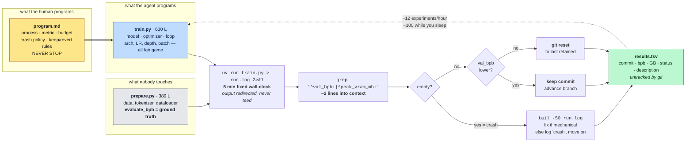

# auto-research-map

Standalone answer to the three questions about [`karpathy/autoresearch`](https://github.com/karpathy/autoresearch). For how this fits the wider loop → swarm → DAG → graph progression, see [README.md](./README.md).

---

## The loop in one diagram

---

## Q1 — What problem does it solve, and what impact does it make?

**Stated problem:** find better hyperparameters and architecture tweaks for a small GPT, overnight, without a human.

**Actual problem — and this is the transferable one — is memory.** A human researcher holds hypotheses, dead ends, and parameter interactions in working memory. It evaporates between sessions and transfers to nobody. autoresearch converts it into a **machine-readable, resumable, reversible history**: every experiment has a parent state, a code diff, a metric, and a keep/discard decision.

**The second transferable idea:** you are not programming `train.py`. You are programming `program.md`. Software 1.0 writes explicit instructions; Software 2.0 shapes behavior through data; here, natural language configures an autonomous *organization* — mutable vs protected files, the metric and its direction, the experiment budget, crash handling, commit/revert rules, logging, escalation policy, exhaustion criteria.

**Reported results:** ~700 experiments in 2 days, ~20 retained optimizations — QK-normalization scaling, value-embedding regularization, AdamW tuning; overnight gains from batch size, depth, embedding LR, RoPE base frequency, targeted weight decay, init scale, warmdown.

**Impact, honestly weighted:**

| Claim | Verdict |
|---|---|
| Found 20 real optimizations | ✅ Real — but local minima on a 5-minute single-GPU toy. They don't transfer. |
| 94k stars / 13.3k forks proves it works | ❌ Popularity is not a performance measure. Read it as evidence the **pattern is legible and reproducible** — small code, visible metric, readable loop. That legibility is the actual contribution. |
| This is how frontier research will be done | ⚠️ The **architecture** transfers — bounded changes, measurable evaluation, reversibility, durable history. The **harness** does not. One GPU is not a cluster with distributed infra, data pipelines, hardware failures, and week-long runs. |

**Why it works at all — four conditions, each one enforced by a design decision:**

| Condition | Enforcement | Failure mode without it |
|---|---|---|
| Output is verifiable | `evaluate_bpb` lives in the read-only file | Agent optimizes its own narrative |
| Action is reversible | `git reset` to last retained commit | One bad experiment poisons the rest |
| Horizon is short | Hard 5-minute budget | Feedback arrives too late to steer |
| Environment is bounded | Exactly one editable file | Action space explodes; diffs stop being reviewable |

Two subtleties worth stealing:

- **Fixed *time*, not fixed *steps*.** Every run is 5 minutes no matter what changed, so a wider model, a bigger batch, and a new optimizer are directly comparable — and the loop finds the best model *for your hardware*. Cost: your results aren't comparable to anyone else's.
- **A simplicity criterion written into the prompt.** A 0.001 gain costing 20 lines of hacky code is explicitly *not* worth keeping; a 0.001 gain from *deleting* code definitely is. Without it, the ratchet monotonically accretes complexity — because the metric cannot see ugliness.

---

## Q2 — What tasks does it actually fit?

### Within a research workflow

| Stage | Fit | Why |
|---|---|---|
| Literature synthesis | ❌ | No verifiable metric; needs cross-source grounding. Knowledge-graph work, not loop work. |
| Hypothesis *generation* | ⚠️ | The loop rewards local perturbation and drifts into narrow optima. `program.md` has to explicitly tell it to "think harder, read the referenced papers, try more radical changes." Direction still comes from the human. |
| **Hyperparameter / architecture local search** | ✅ **Ideal** | Bounded surface, one scalar, minutes per trial, free rollback. |
| **Experiment execution & bookkeeping** | ✅ **Ideal** | Never forgets to log, mislabels a run, or loses the parent commit. Strictly better than a tired human at 3am. |
| Ablation sweeps | ✅ Strong | Serial here; embarrassingly parallel the moment you add a second GPU and a shared DAG. |
| Result interpretation | ⚠️ | Tells you *what* improved, not reliably *why* — and has no incentive to care. |
| Write-up / narrative | ❌ | Needs one coherent context and a taste function. Fragmenting degrades it. |

### The general test — six questions in order

1. **Can success be verified?** If no → **do not start with autonomy.** Define a test, rubric, source requirement, or human decision first.
2. **Are the steps stable?** Yes → chain. No → planning or an orchestrator.
3. **Are subtasks independent?** Yes → parallelize. No → model dependencies, limit concurrent writes.
4. **Must alternative lineages stay alive?** Yes → a DAG, not one forced main branch.
5. **Must facts survive the run?** Yes → persist artifacts and graph state, not transcript summaries.
6. **Can you afford the cost and latency?** Set budgets *before* adding workers.

### The ladder

| Situation | Start with |
|---|---|
| Simple, low-risk question | Zero-shot |
| **Output can be checked** | **Loop — this is autoresearch** |
| Stable sequence | Chain |
| Clear categories | Router |
| Independent units | Parallel |
| Variable decomposition | Orchestrator-workers |
| Alternatives must remain | Commit DAG |
| Facts must survive sessions | Knowledge graph |
| Very large parallel work | Dynamic workflow |

### Where it breaks

- **Metrics are gameable.** A ratchet improves only the metric it can see. It will trade inference cost, robustness, and generalization for val loss — which is exactly why VRAM is kept as a soft constraint and simplicity is written into the prompt.
- **One GPU is not a cluster.** Distributed infra, data pipelines, hardware failures, multi-objective tradeoffs, week-long experiments — none of it is modeled.
- **Coupled work degrades when fragmented.** Architecture design, narrative writing, tightly coupled refactors, subtle product decisions all need one coherent context.

---

## Q3 — Does it burn a ton of tokens?

**No, not per hour — it is one of the most token-frugal autonomous loops you can run, because it is GPU-bound rather than model-bound. Yes in absolute terms, because it is designed never to stop.**

### Three deliberate choices that make it cheap

1. **`> run.log 2>&1`, explicitly not `tee`.** `program.md` spells out the reason: "do NOT use tee or let output flood your context." Hundreds of log lines per run, zero of them in context.
2. **The readout is two grepped lines** (~20 tokens). Full logs are read only on a crash, and then only `tail -n 50`.
3. **A 5-minute dead wait every cycle.** The model idles while the GPU works — a duty cycle of roughly **20–30%**, versus ~100% for a normal coding agent that pipes build output straight into context.

### The arithmetic

One-time context load: `README.md` (8.0 KB) + `prepare.py` (15.0 KB) + `train.py` (26.2 KB) + `program.md` (7.0 KB) ≈ **15.5k tokens**.

Per experiment: 5–14 assistant turns. Each turn resends the conversation, so **input is dominated by cache reads**; context grows ~2–7k tokens per experiment until compaction.

| | Lean low effort, clean runs | Typical | Heavy max effort, crash debugging |
|---|---|---|---|
| Turns / experiment | ~5 | ~8 | ~14 |
| Avg context carried | ~40k | ~90k | ~150k |
| **Input tokens / experiment** | ~200k | ~700k | ~2.1M |
| **Output tokens / experiment** | ~1.5k | ~4k | ~10k |
| **Cost / experiment** | **~$0.25** | **~$0.85** | **~$2.40** |
| Overnight, ~100 experiments | ~$25 | ~$85 | ~$240 |
| Full run, ~700 experiments / 2 days | ~$175 | ~$600 | ~$1,700 |
| Output tokens, full run | ~1M | ~2.8M | ~7M |

Costed on Claude Opus 5 list pricing — **$5 / $25 per million input/output tokens**, cache reads **0.1×** ($0.50/M), cache writes **1.25×** ($6.25/M) — assuming ~90% cache-read / 5% cache-write / 5% fresh on input. Sonnet-tier roughly halves it. These are estimates derived from file sizes and the loop structure, not measurements from a real run.

### The comparison that actually settles it

| Resource, 8-hour overnight run | Cost |
|---|---|
| H100 on-demand | ~$16–$25 |
| **Agent tokens** | **~$25–$240** |

**Same order of magnitude.** Budget for tokens like you budget for the GPU — but this is not a runaway.

### Levers, cheapest first

1. **Lower the effort setting.** Single biggest lever; moves you straight down the table.
2. **Cap the run.** `program.md` says NEVER STOP *by design*. That instruction — not the token rate — is what makes the bill large. Wrap it in a wall-clock or experiment-count limit.
3. **Keep the log discipline.** Never `tee`, never read `run.log` on success. Already correct in the repo; don't "improve" it.
4. **Watch crash loops.** A crashing idea costs a `tail -50` plus a fix attempt with **no 5-minute dead time** — crashes are the expensive path. This is why `program.md` says give up after a few attempts.
5. **Compact aggressively.** Input scales with carried context × turns; that product is the dominant term.

### The caveat

**This is the cheap case.** Follow the natural next step — swarms, fan-out, verification waves — and the economics invert. Anthropic's Dynamic Workflows spawn up to 16 concurrent sub-agents with a hard cap of 1,000 per workflow, and *"a 1,000-sub-agent run at high effort can cost tens of dollars"* — **per run, in minutes, not overnight.** Parallel workers also produce correlated errors, so the verification wave you add to compensate only helps if reviewers get a different prompt, evidence set, or role.

autoresearch is the frugal end of this design space. It is not the representative one.

---

*Repo data fetched live via `gh` on 2026-08-18: 94,030 stars, 13,325 forks, MIT, created 2026-03-06, last push 2026-03-26.*
